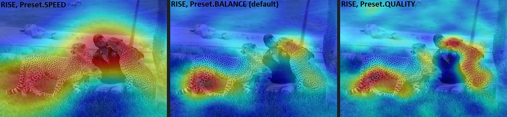

# OpenVINO™ Explainable AI Toolkit User Guide

**OpenVINO™ Explainable AI (XAI) Toolkit** provides a suite of XAI algorithms for visual explanation of OpenVINO™ Intermediate Representation (IR) models.
Model explanation helps to identify the parts of the input that are responsible for the model's prediction,
which is useful for analyzing model's performance.

Current tutorial is primarily for classification CNNs.

OpenVINO XAI API documentation can be found [here](https://openvinotoolkit.github.io/openvino_xai/).

Content:

- [OpenVINO™ Explainable AI Toolkit User Guide](#openvino-explainable-ai-toolkit-user-guide)
  - [OpenVINO XAI Architecture](#openvino-xai-architecture)
  - [`Explainer`: the main interface to XAI algorithms](#explainer-the-main-interface-to-xai-algorithms)
    - [Create Explainer for OpenVINO Model instance](#create-explainer-for-openvino-model-instance)
    - [Create Explainer from OpenVINO IR file](#create-explainer-from-openvino-ir-file)
    - [Create Explainer from ONNX model file](#create-explainer-from-onnx-model-file)
  - [Basic usage: Auto mode](#basic-usage-auto-mode)
    - [Running without `preprocess_fn`](#running-without-preprocess_fn)
    - [Specifying `preprocess_fn`](#specifying-preprocess_fn)
  - [White-Box mode](#white-box-mode)
  - [Black-Box mode](#black-box-mode)
  - [XAI insertion (white-box usage)](#xai-insertion-white-box-usage)
  - [XAI methods](#xai-methods)
    - [Overview](#overview)
    - [White-box methods](#white-box-methods)
    - [Black-box methods](#black-box-methods)
  - [Plot saliency maps](#plot-saliency-maps)
  - [Saving saliency maps](#saving-saliency-maps)
  - [Example scripts](#example-scripts)


## OpenVINO XAI Architecture


OpenVINO XAI provides the API to explain models, using two types of methods:

- **White-box** - treats the model as a white box, making inner modifications and adding an extra XAI branch. This results in additional output from the model and relatively fast explanations.
- **Black-box** - treats the model as a black box, working on a wide range of models. However, it requires many more inference runs.

## `Explainer`: the main interface to XAI algorithms

In a nutshell, the explanation call looks like this:

```python
import openvino_xai as xai

explainer = xai.Explainer(model=model, task=xai.Task.CLASSIFICATION)
explanation = explainer(data)
```

There are a few options for the model formats. The major use-case is to load OpenVINO IR model from file and pass `ov.Model` instance to explainer.

### Create Explainer for OpenVINO Model instance

```python
import openvino as ov
model = ov.Core().read_model("model.xml")

explainer = xai.Explainer(
    model=model,
    task=xai.Task.CLASSIFICATION
)
```

### Create Explainer from OpenVINO IR file

The Explainer also supports the OpenVINO IR (Intermediate Representation) file format (.xml) directly like follows:

```python
explainer = xai.Explainer(
    model="model.xml",
    task=xai.Task.CLASSIFICATION
)
```

### Create Explainer from ONNX model file

[ONNX](https://onnx.ai/) is an open format built to represent machine learning models.
The OpenVINO Runtime supports loading and inference of the ONNX models, and so does OpenVINO XAI.

```python
explainer = xai.Explainer(
    model="model.onnx",
    task=xai.Task.CLASSIFICATION
)
```

## Basic usage: Auto mode

The easiest way to run the explainer is in Auto mode. Under the hood, Auto mode will try to run in `White-Box` mode first. If it fails, it will run in `Black-Box` mode.

Learn more details about [White-Box](#white-box-mode) and [Black-Box](#black-box-mode) modes below.


Generating saliency maps involves model inference. Explainer will perform model inference but to do it, it requires `preprocess_fn` and `postprocess_fn`.

### Running without `preprocess_fn`

Here's the example how we can avoid passing `preprocess_fn` by preprocessing data beforehand (like resizing and adding a batch dimension).

```python
import cv2
import numpy as np
from typing import Mapping
import openvino.runtime as ov

import openvino_xai as xai


def postprocess_fn(x: Mapping):
    # Implementing our own post-process function based on the model's implementation
    # Return "logits" model output
    return x["logits"]

# Create ov.Model
model = ov.Core().read_model("path/to/model.xml")  # type: ov.Model

# Explainer object will prepare and load the model once in the beginning
explainer = xai.Explainer(
    model,
    task=xai.Task.CLASSIFICATION,
    postprocess_fn=postprocess_fn,
)

# Generate and process saliency maps (as many as required, sequentially)
image = cv2.imread("path/to/image.jpg")

# Pre-process the image as the model requires (resizing and adding a batch dimension)
preprocessed_image = cv2.resize(src=image, dsize=(224, 224))
preprocessed_image = np.expand_dims(preprocessed_image, 0)

# Run explanation
explanation = explainer(
    preprocessed_image,
    targets=[11, 14],  # indices or string labels to explain
    overlay=True,  # False by default
    original_input_image=image,  # to apply overlay on the original image instead of the preprocessed one that was used for the explainer
)

# Save saliency maps
explanation.save("output_path", "name_")
```

### Specifying `preprocess_fn`


```python
import cv2
import numpy as np
from typing import Mapping
import openvino.runtime as ov

import openvino_xai as xai


def preprocess_fn(x: np.ndarray) -> np.ndarray:
    # Implementing our own pre-process function based on the model's implementation
    x = cv2.resize(src=x, dsize=(224, 224))
    x = np.expand_dims(x, 0)
    return x

def postprocess_fn(x: Mapping):
    # Implementing our own post-process function based on the model's implementation
    # Return "logits" model output
    return x["logits"]

# Create ov.Model
model = ov.Core().read_model("path/to/model.xml")  # type: ov.Model

# The Explainer object will prepare and load the model once in the beginning
explainer = xai.Explainer(
    model,
    task=xai.Task.CLASSIFICATION,
    preprocess_fn=preprocess_fn,
    postprocess_fn=postprocess_fn,
)

# Generate and process saliency maps (as many as required, sequentially)
image = cv2.imread("path/to/image.jpg")

# Run explanation
explanation = explainer(
    image,
    targets=[11, 14],  # indices or string labels to explain
)

# Save saliency maps
explanation.save("output_path", "name_")
```


## White-Box mode

White-box mode involves two steps: updating the OV model and then running the updated model.

The updated model has an extra XAI branch resulting in an additional `saliency_map` output. This XAI branch creates saliency maps during the model's inference. The computational load from the XAI branch varies depending on the white-box algorithm, but it's usually quite small.

You need to pass either `preprocess_fn` or already preprocessed images to run the explainer in white-box mode.

```python
import cv2
import numpy as np
import openvino.runtime as ov

import openvino_xai as xai
from openvino_xai.explainer import ExplainMode


def preprocess_fn(x: np.ndarray) -> np.ndarray:
    # Implementing own pre-process function based on the model's implementation
    x = cv2.resize(src=x, dsize=(224, 224))
    x = np.expand_dims(x, 0)
    return x

# Create ov.Model
model = ov.Core().read_model("path/to/model.xml")  # type: ov.Model

# The Explainer object will prepare and load the model once at the beginning
explainer = xai.Explainer(
    model,
    task=xai.Task.CLASSIFICATION,
    preprocess_fn=preprocess_fn,
)

# Generate and process saliency maps (as many as required, sequentially)
image = cv2.imread("path/to/image.jpg")

voc_labels = [
    'aeroplane', 'bicycle', 'bird', 'boat', 'bottle', 'bus', 'car', 'cat', 'chair', 'cow', 'diningtable',
    'dog', 'horse', 'motorbike', 'person', 'pottedplant', 'sheep', 'sofa', 'train', 'tvmonitor'
]

# Run explanation
explanation = explainer(
    image,
    explain_mode=ExplainMode.WHITEBOX,
    # target_layer="last_conv_node_name",  # target_layer - node after which the XAI branch will be inserted, usually the last convolutional layer in the backbone
    embed_scaling=True,  # True by default. If set to True, the saliency map scale (0 ~ 255) operation is embedded in the model
    explain_method=xai.Method.RECIPROCAM,  # ReciproCAM is the default XAI method for CNNs
    label_names=voc_labels,
    targets=[11, 14],  # target classes to explain, also ['dog', 'person'] is a valid input, since label_names are provided
    overlay=True,  # False by default
)

# Save saliency maps
explanation.save("output_path", "name_")
```


## Black-Box mode

Black-box mode does not update the model (treating the model as a black box).
Black-box approaches are based on the perturbation of the input data and measurement of the model's output change.

For black-box mode we support 2 algorithms: **AISE** (by default) and [**RISE**](https://arxiv.org/abs/1806.07421). AISE is more effective for generating saliency maps for a few specific classes. RISE - to generate maps for all classes at once. AISE is supported for both classification and detection task.

Pros:
- **Flexible** - can be applied to any custom model.
Cons:
- **Computational overhead** - black-box requires hundreds or thousands of forward passes.

`preprocess_fn` (or preprocessed images) and `postprocess_fn` are required to be provided by the user for black-box mode.

```python
import cv2
import numpy as np
import openvino.runtime as ov

import openvino_xai as xai
from openvino_xai.explainer import ExplainMode


def preprocess_fn(x: np.ndarray) -> np.ndarray:
    # Implementing our own pre-process function based on the model's implementation
    x = cv2.resize(src=x, dsize=(224, 224))
    x = np.expand_dims(x, 0)
    return x

# Create ov.Model
model = ov.Core().read_model("path/to/model.xml")  # type: ov.Model

# The Explainer object will prepare and load the model once at the beginning
explainer = xai.Explainer(
    model,
    task=xai.Task.CLASSIFICATION,
    preprocess_fn=preprocess_fn,
)

# Generate and process saliency maps (as many as required, sequentially)
image = cv2.imread("path/to/image.jpg")

# Run explanation
explanation = explainer(
    image,
    explain_mode=ExplainMode.BLACKBOX,
    targets=[11, 14],  # target classes to explain
    # targets=-1,  # explain all classes
    overlay=True,  # False by default
)

# Save saliency maps
explanation.save("output_path", "name_")

```


## XAI insertion (white-box usage)

As mentioned above, saliency map generation requires model inference. In the above use cases, OpenVINO XAI performs model inference using provided processing functions. An alternative approach is to use XAI to insert the XAI branch into the model and infer it in the original pipeline.

`insert_xai()` API is used for insertion.

**Note**: The original model outputs are not affected, and the model should be inferable by the original inference pipeline.

```python
import openvino.runtime as ov
import openvino_xai as xai
from openvino_xai.common.utils import softmax
from openvino_xai.explainer.visualizer colormap, overlay


# Create an ov.Model
model: ov.Model = ov.Core().read_model("path/to/model.xml")

# Insert XAI branch into the OpenVINO model graph (IR)
model_xai: ov.Model = xai.insert_xai(
    model=model,
    task=xai.Task.CLASSIFICATION,
    # target_layer="last_conv_node_name",  # target_layer - the node after which the XAI branch will be inserted, usually the last convolutional layer in the backbone. Defaults to None, by which the target layer is automatically detected
    embed_scaling=True,  # True by default. If set to True, the saliency map scale (0 ~ 255) operation is embedded in the model
    explain_method=xai.Method.RECIPROCAM,  # ReciproCAM is the default XAI method for CNNs
)

# Insert XAI branch into the Pytorch model
# XAI head is inserted using the module hook mechanism internally
# so that users could get additional saliency map without major changes in the original inference pipeline.
model: torch.nn.Module

# Insert XAI head
model_xai: torch.nn.Module = insert_xai(model=model, task=xai.Task.CLASSIFICATION)

# Torch XAI model inference
model_xai.eval()
with torch.no_grad():
    outputs = model_xai(torch.from_numpy(image_norm))
    logits = outputs["prediction"]  # BxC: original model prediction
    saliency_maps = outputs["saliency_map"]  # BxCxhxw: additional per-class saliency map
    probs = torch.softmax(logits, dim=-1)
    label = probs.argmax(dim=-1)[0]

# Torch XAI model saliency map
saliency_maps = saliency_maps.numpy(force=True).squeeze(0)  # Cxhxw
saliency_map = saliency_maps[label]  # hxw saliency_map for the label
saliency_map = colormap(saliency_map[None, :])  # 1xhxw
saliency_map = cv2.resize(saliency_map.squeeze(0), dsize=input_size)  # HxW
result_image = overlay(saliency_map, image)
```

## XAI methods

### Overview

At the moment, the following XAI methods are supported:

| Method                 | Using model internals | Per-target support | Single-shot | #Model inferences |
|------------------------|-----------------------|--------------------|-------------|-------------------|
| White-Box              |                       |                    |             |                   |
| Activation Map         | Yes                   | No                 | Yes         | 1                 |
| Recipro-CAM            | Yes                   | Yes (class)        | Yes*        | 1*                |
| ViT Recipro-CAM        | Yes                   | Yes (class)        | Yes*        | 1*                |
| DetClassProbabilityMap | Yes**                 | Yes (class)        | Yes         | 1                 |
| Black-Box              |                       |                    |             |                   |
| RISE                   | No                    | Yes (class)        | No          | 1000-10000        |
| AISEClassification     | No                    | Yes (class)        | No          | 120-500           |
| AISEDetection          | No                    | Yes (bbox)         | No          | 60-250            |

\* Recipro-CAM re-infers part of the graph (usually neck + head or last transformer block) H*W times, where HxW – feature map size of the target layer.

** DetClassProbabilityMap requires explicit definition of the target layers.
The rest of the white-box methods support automatic detection of the target layer.

Target layer is the part of the model graph where XAI branch will be inserted (applicable for white-box methods).

All supported methods are gradient-free, which suits deployment framework settings (e.g. OpenVINO™), where the model is in optimized or compiled representation.

### White-Box methods

When to use?
- When model architecture follows standard CNN-based or ViT-based design (OV-XAI [support](../../README.md#supported-explainable-models) 1000+ CNN and ViT models).
- When speed matters. White-box methods are fast - it takes ~one model inference to generate saliency map.
- When it is required to obtain saliency map together with model prediction at the inference server environment. White-box methods update model graph, so that the XAI branch and saliency map output added to the model. Therefore, with a minor compute overhead, it is possible to generate both model predictions and saliency maps.

All white-box methods require access to model internal state. To generate saliency map, supported white-box methods potentially change and process internal model activations in a way that fosters compute efficiency.

#### Activation Map

Suitable for:
- Binary classification problems (e.g. inspecting model reasoning when predicting a positive class).
- Visualization of the global (class-agnostic) model attention (e.g. inspecting which input pixels are the most salient for the model).

Activation Map is the most basic and naive approach. It takes the outputs of the model’s feature extractor (backbone) and averages it in the channel dimension. The results highly rely on the backbone and ignore neck and head computations. Basically, it gives a relatively good and fast result, which highlight the most activated features from the backbone perspective.

Below saliency map was obtained for [ResNet-18](https://huggingface.co/timm/resnet18.a1_in1k) from [timm](https://huggingface.co/timm):


#### Recipro-CAM (ViT Recipro-CAM for ViT models)

Suitable for:
- Almost all CNN-based architectures.
- Many ViT-based architectures.

[Recipro-CAM](../../openvino_xai/methods/white_box/recipro_cam.py) involves spatially masking of the extracted feature maps to exploit the correlation between activation maps and model predictions for target classes. It is perturbation-based method which perturbs internal model activations.

Assume 7x7 feature map which is extracted by the CNN backbone. One location of the feature map is preserved (e.g. at index [0, 0]), while the rest feature map values is masked out with e.g. zeros (perturbation is the same across channel dimension). Perturbed feature map inferred through the model head. The the model prediction scores are used as saliency scores for index [0, 0]. This is repeated for all 49 spatial location. The final saliency map obtained after resizing and scaling. See [paper](https://arxiv.org/abs/2209.14074) for more details.

`Recipro-CAM` is an efficient XAI method.
The main weak point is that saliency for each pixel in the feature map space is estimated in isolation, without taking into account joint contribution of different pixels/features.

`Recipro-CAM` is the default method for the classification task. [ViT Recipro-CAM](../../openvino_xai/methods/white_box/recipro_cam.py) is a modification of Recipro-CAM for ViT-based models.

Below saliency map was obtained for [ResNet-18](https://huggingface.co/timm/resnet18.a1_in1k) from [timm](https://huggingface.co/timm) and "cheetah" class:


#### DetClassProbabilityMap

Suitable for:
- Single-stage object detection models.
- When it is enough to estimate saliency maps per-class.

[DetClassProbabilityMap](../../openvino_xai/methods/white_box/det_class_probability_map.py) takes the raw classification head output and uses class probability maps to calculate regions of interest for each class. So, it creates different salience maps for each class. This algorithm is implemented for single-stage detectors only and required explicit list of target layers.

The main limitation of this method is that, due to the training loss design of most single-stage detectors, activation values drift towards the center of the object while propagating through the network. Many object detectors, while being designed to precisely estimate location of the objects, might mess up spatial location of object features in the latent space.

Below saliency map was obtained for `YOLOX` trained in-house on PASCAL VOC dataset:


### Black-Box methods

When to use?
- When custom models are used and/or white-box methods fail (e.g. Swin-based transformers).
- When more advanced model explanation is required. See more details below (e.g. in the RISE overview).
- When spacial location of the features is messed up in the latent space (e.g. some single-stage object detection models).

All black-box methods are perturbation-based - they perturb the input and register the change in the output.
Usually, for high quality saliency map, hundreds or thousands of model inferences required. That is the reason for them to be compute-inefficient. On the other hand, black box methods are model-agnostic.

Given that the quality of the saliency maps usually correlates with the number of available inferences, we propose the following presets for the black-box methods: `Preset.SPEED`, `Preset.BALANCE`, `Preset.QUALITY` (`Preset.BALANCE` is used by default).
Apart from that, methods parameters can be defined directly via Explainer or Method API.

#### RISE

Suitable for:
- All classification models which can generate per-class prediction scores.
- More flexibility and more advanced use cases (e.g. control of granularity of the saliency map).

[RISE](../../openvino_xai/methods/black_box/rise.py) probes a model by sub-sampling the input image via random masks and records its response to each of them.
RISE creates random masks from down-scaled space (e.g. 7×7 grid) and adds random translation shifts for the pixel-level explanation with further up-sampling. Weighted sum of all sampled masks used to generate the fine-grained saliency map.
Since it approximates the true saliency map with Monte Carlo sampling, it requires multiple thousands of forward passes to generate a fine-grained saliency map. RISE is a non-deterministic method.
See [paper](https://arxiv.org/abs/1806.07421v3) for more details.

`RISE` generates saliency maps for all classes at once, although indices of target classes can be provided (which might bring some performance boost).

`RISE` has two main hyperparameter: `num_cells` (define the resolution of the grid for the masks) and `num_masks` (defines number of inferences).
Number of cells defines granularity of the saliency map (usually, the higher the granularity - the better). Higher number of cells require more masks to converge. Going from `Preset.SPEED` to `Preset.QUALITY`, the number of masks (compute budget) increases.

Below saliency map was obtained for [ResNet-18](https://huggingface.co/timm/resnet18.a1_in1k) from [timm](https://huggingface.co/timm) and "cheetah" class (default parameters).



It is possible to see, that some grass-related pixels from the left cheetah also contribute to the cheetah prediction, which might indicates that model learned cheetah features in combination with grass (which makes sense).

#### AISEClassification

Suitable for:
- All classification models which can generate per-class prediction scores.
- Cases when speed matters.

`AISE` formulates saliency map generation as a kernel density estimation (KDE) problem, and adaptively sample input masks using a derivative-free optimizer to maximize mask saliency score. KDE requires a proper kernel width, which is not known. A set of pre-defined kernel widths is used simultaneously, and the result is them aggregated. This adaptive sampling mechanism improves the efficiency of input mask generation and thus increases convergence speed. AISE is designed to be task-agnostic and can be applied to a wide range of classification and object detection architectures.
`AISE` is optimized for generating saliency map for a specific class (or a few classes). To specify target classes, use targets argument.

[AISEClassification](../../openvino_xai/methods/black_box/aise/classification.py) is designed for classification models.

Below saliency map was obtained for [ResNet-18](https://huggingface.co/timm/resnet18.a1_in1k) from [timm](https://huggingface.co/timm) and "cheetah" class:


#### AISEDetection

Suitable for:
- All detection models which can generate bounding boxes, labels and scores.
- When speed matters.
- When it is required to get per-box saliency map.

[AISEDetection](../../openvino_xai/methods/black_box/aise/detection.py) is designed for detection models and support per-bounding box saliency maps.

Below saliency map was obtained for `YOLOX` trained in-house on PASCAL VOC dataset (with default parameters, `Preset.BALANCE`):


## Plot saliency maps

To visualize saliency maps, use the `explanation.plot` function.

The `matplotlib` backend is more convenient for plotting saliency maps in Jupyter notebooks, as it uses the Matplotlib library. By default it generates the grid with 4 images per row (can be agjusted by `num_collumns` parameter).

The `cv` backend is better for visualization in Python scripts, as it opens extra windows to display the generated saliency maps.

```python
import cv2
import numpy as np
import openvino.runtime as ov

import openvino_xai as xai
from openvino_xai.explainer import ExplainMode

def preprocess_fn(image: np.ndarray) -> np.ndarray:
    """Preprocess the input image."""
    resized_image = cv2.resize(src=image, dsize=(224, 224))
    expanded_image = np.expand_dims(resized_image, 0)
    return expanded_image

# Create ov.Model
MODEL_PATH = "path/to/model.xml"
model = ov.Core().read_model(MODEL_PATH)  # type: ov.Model

# The Explainer object will prepare and load the model once in the beginning
explainer = xai.Explainer(
    model,
    task=xai.Task.CLASSIFICATION,
    preprocess_fn=preprocess_fn,
)

voc_labels = [
    'aeroplane', 'bicycle', 'bird', 'boat', 'bottle', 'bus', 'car', 'cat', 'chair', 'cow', 'diningtable',
    'dog', 'horse', 'motorbike', 'person', 'pottedplant', 'sheep', 'sofa', 'train', 'tvmonitor'
]

# Generate and process saliency maps (as many as required, sequentially)
image = cv2.imread("path/to/image.jpg")

# Run explanation
explanation = explainer(
    image,
    explain_mode=ExplainMode.WHITEBOX,
    label_names=voc_labels,
    targets=[7, 11],  # ['cat', 'dog'] also possible as target classes to explain
)

# Use matplotlib (recommended for Jupyter) - default backend
explanation.plot() # plot all saliency map
explanation.plot(targets=[7], backend="matplotlib")
explanation.plot(targets=["cat"], backend="matplotlib")
# Plots a grid with 5 images per row
explanation.plot(num_columns=5, backend="matplotlib")

# Use OpenCV (recommended for Python) - will open new windows with saliency maps
explanation.plot(backend="cv") # plot all saliency map
explanation.plot(targets=[7], backend="cv")
explanation.plot(targets=["cat"], backend="cv")
```

## Saving saliency maps

You can easily save saliency maps with flexible naming options by using a `prefix` and `postfix`. The `prefix` allows saliency maps from the same image to have consistent naming.

The format for naming is:

`{prefix} + target_id + {postfix}.jpg`

Additionally, you can include the confidence score for each class in the saved saliency map's name.

`{prefix} + target_id + {postfix} + confidence.jpg`

```python
import cv2
import numpy as np
import openvino.runtime as ov
from typing import Mapping

import openvino_xai as xai
from openvino_xai.explainer import ExplainMode

def preprocess_fn(image: np.ndarray) -> np.ndarray:
    """Preprocess the input image."""
    x = cv2.resize(src=image, dsize=(224, 224))
    x = x.transpose((2, 0, 1))
    processed_image = np.expand_dims(x, 0)
    return processed_image

def postprocess_fn(output: Mapping):
    """Postprocess the model output."""
    output = softmax(output)
    return output[0]

def softmax(x: np.ndarray) -> np.ndarray:
    """Compute softmax values of x."""
    e_x = np.exp(x - np.max(x))
    return e_x / e_x.sum()

# Generate and process saliency maps (as many as required, sequentially)
image = cv2.imread("path/to/image.jpg")

# Create ov.Model
MODEL_PATH = "path/to/model.xml"
model = ov.Core().read_model(MODEL_PATH)  # type: ov.Model

# The Explainer object will prepare and load the model once in the beginning
explainer = xai.Explainer(
    model,
    task=xai.Task.CLASSIFICATION,
    preprocess_fn=preprocess_fn,
)

voc_labels = [
    'aeroplane', 'bicycle', 'bird', 'boat', 'bottle', 'bus', 'car', 'cat', 'chair', 'cow', 'diningtable',
    'dog', 'horse', 'motorbike', 'person', 'pottedplant', 'sheep', 'sofa', 'train', 'tvmonitor'
]

# Get predicted confidences for the image
compiled_model = core.compile_model(model=model, device_name="AUTO")
logits = compiled_model(preprocess_fn(image))[0]
result_infer = postprocess_fn(logits)

# Generate list of predicted class indices and scores
result_idxs = np.argwhere(result_infer > 0.4).flatten()
result_scores = result_infer[result_idxs]

# Generate dict {class_index: confidence} to save saliency maps
scores_dict = {i: score for i, score in zip(result_idxs, result_scores)}

# Run explanation
explanation = explainer(
    image,
    explain_mode=ExplainMode.WHITEBOX,
    label_names=voc_labels,
    targets=result_idxs,  # target classes to explain
)

# Save saliency maps flexibly
OUTPUT_PATH = "output_path"
explanation.save(OUTPUT_PATH)  # aeroplane.jpg
explanation.save(OUTPUT_PATH, "image_name_target_")  # image_name_target_aeroplane.jpg
explanation.save(OUTPUT_PATH, prefix="image_name_target_")  # image_name_target_aeroplane.jpg
explanation.save(OUTPUT_PATH, postfix="_class_map")  # aeroplane_class_map.jpg
explanation.save(OUTPUT_PATH, prefix="image_name_", postfix="_class_map")  # image_name_aeroplane_class_map.jpg

# Save saliency maps with confidence scores
explanation.save(
    OUTPUT_PATH, prefix="image_name_", postfix="_conf_", confidence_scores=scores_dict
)  # image_name_aeroplane_conf_0.85.jpg
```

## Example scripts

More usage scenarios that can be used with your own models and images as arguments are available in [examples](../../examples).

```python
# Retrieve models by running tests
# Models are downloaded and stored in .data/otx_models
pytest tests/test_classification.py

# Run a bunch of classification examples
# All outputs will be stored in the corresponding output directory
python examples/run_classification.py .data/otx_models/mlc_mobilenetv3_large_voc.xml
tests/assets/cheetah_person.jpg --output output
```
