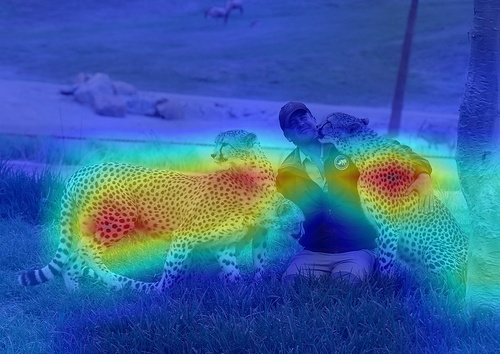

# XAI methods User Guide

## Methods overvew

At the moment, *Image Classification* and *Object Detection* tasks are supported for the *Computer Vision* domain.
*Black-Box* (model agnostic but slow) methods and *White-Box* (model specific but fast) methods are supported:

| Domain          | Task                 | Type      | Algorithm           | Links |
|-----------------|----------------------|-----------|---------------------|-------|
| Computer Vision | Image Classification | White-Box | ReciproCAM          | [arxiv](https://arxiv.org/abs/2209.14074) / [src](openvino_xai/methods/white_box/recipro_cam.py) |
|                 |                      |           | VITReciproCAM       | [arxiv](https://arxiv.org/abs/2310.02588) / [src](openvino_xai/methods/white_box/recipro_cam.py) |
|                 |                      |           | ActivationMap       | experimental / [src](openvino_xai/methods/white_box/activation_map.py)                           |
|                 |                      | Black-Box | AISEClassification  | [src](openvino_xai/methods/black_box/aise.py)                                                    |
|                 |                      |           | RISE                | [arxiv](https://arxiv.org/abs/1806.07421v3) / [src](openvino_xai/methods/black_box/rise.py)      |
|                 | Object Detection     | White-Box | ClassProbabilityMap | experimental / [src](openvino_xai/methods/white_box/det_class_probability_map.py)                |
|                 |                      | Black-Box | AISEDetection       | [src](openvino_xai/methods/black_box/aise.py)                                                    |

Below we show the comparison of supported methods.

| Method                 | Using model internals | Per-target support | Single-shot | #Model inferences |
|------------------------|-----------------------|--------------------|-------------|-------------------|
| White-Box              |                       |                    |             |                   |
| Activation Map         | Yes                   | No                 | Yes         | 1                 |
| Recipro-CAM            | Yes                   | Yes (class)        | Yes*        | 1*                |
| ViT Recipro-CAM        | Yes                   | Yes (class)        | Yes*        | 1*                |
| DetClassProbabilityMap | Yes**                | Yes (class)        | Yes         | 1                 |
| Black-Box              |                       |                    |             |                   |
| RISE                   | No                    | Yes (class)        | No          | 2000-8000         |
| AISEClassification     | No                    | Yes (class)        | No          | 300-..            |
| AISEDetection          | No                    | Yes (bbox)         | No          | 150-..            |

\* Recipro-CAM re-infers part of the graph (usually neck + head or last transformer block) H*W times, where HxW – feature map size of the target layer.

** DetClassProbabilityMap requires explicit definition of the target layers. The rest of the white-box methods support automatic detection of the target layer.

Target layer is the part of the model graph where XAI branch will be inserted.

All supported methods are gradient-free.

## White-Box methods
When to use? TBD

### Activation Map
Suitable for:
- Binary classification problems (e.g. inspecting model reasoning when predicting a positive class).
- Visualization of the global (class-agnostic) model attention (e.g. inspecting which input pixels are the most salient for the model).

### Recipro-CAM (ViT Recipro-CAM for ViT models)
Default method for the classification task.

### DetClassProbabilityMap

## Black-Box methods
When to use? TBD

### RISE

### AISEClassification

### AISEDetection
